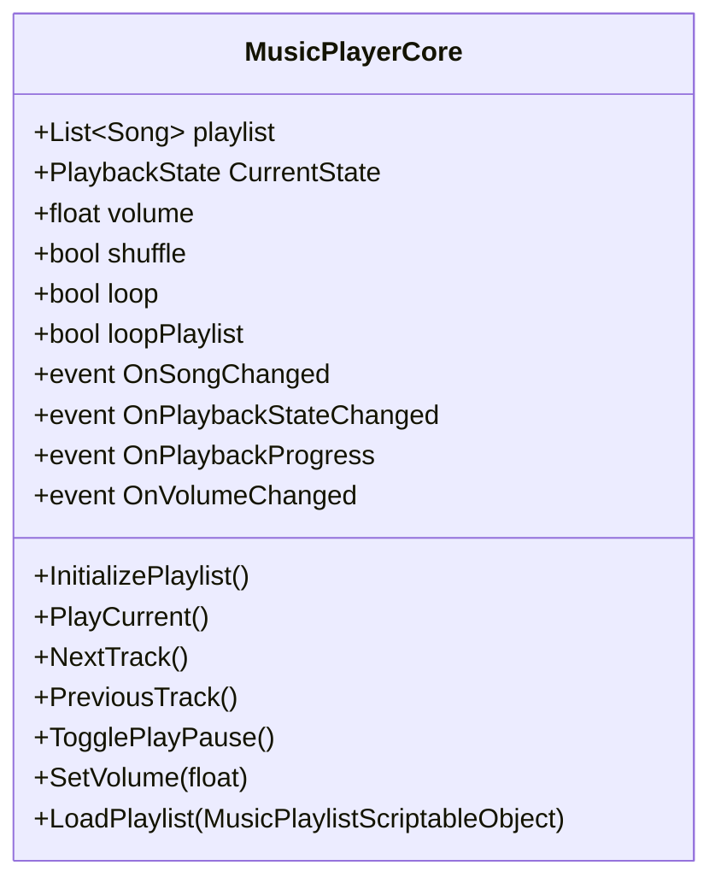
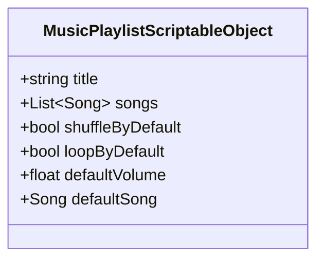
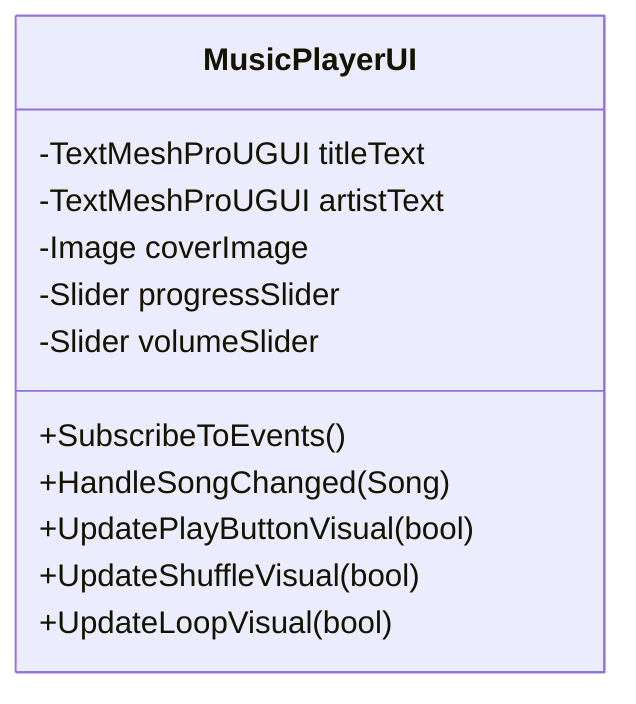
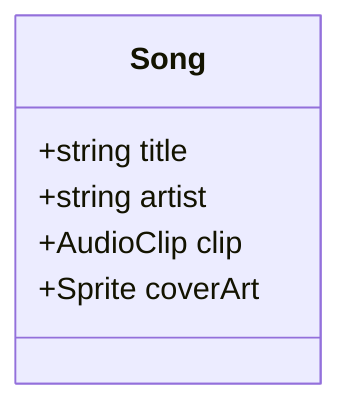

# Core Classes
## MusicPlayerCore

```mermaid
classDiagram
    class MusicPlayerCore {
        +List~Song~ playlist
        +PlaybackState CurrentState
        +float volume
        +bool shuffle
        +bool loop
        +bool loopPlaylist
        +InitializePlaylist()
        +PlayCurrent()
        +NextTrack()
        +PreviousTrack()
        +TogglePlayPause()
        +SetVolume(float)
        +LoadPlaylist(MusicPlaylistScriptableObject)
        +event OnSongChanged
        +event OnPlaybackStateChanged
        +event OnPlaybackProgress
        +event OnVolumeChanged
    }
```
## MusicPlaylistScriptableObject

```mermaid
classDiagram
    class MusicPlaylistScriptableObject {
        +string title
        +List~Song~ songs
        +bool shuffleByDefault
        +bool loopByDefault
        +float defaultVolume
        +Song defaultSong
    }
```
## MusicPlayerUI

```mermaid
classDiagram
    class MusicPlayerUI {
        -TextMeshProUGUI titleText
        -TextMeshProUGUI artistText
        -Image coverImage
        -Slider progressSlider
        -Slider volumeSlider
        
        +SubscribeToEvents()
        +HandleSongChanged(Song)
        +UpdatePlayButtonVisual(bool)
        +UpdateShuffleVisual(bool)
        +UpdateLoopVisual(bool)
    }
```
## Song

```mermaid
classDiagram
    class Song {
        +string title
        +string artist
        +AudioClip clip
        +Sprite coverArt
    }
```