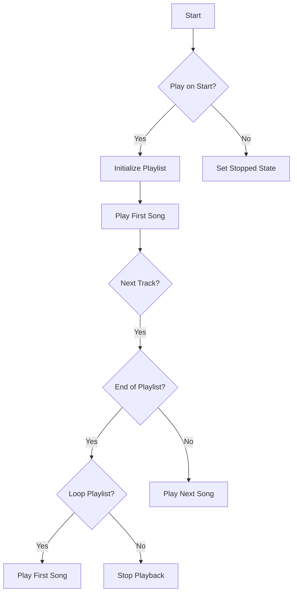
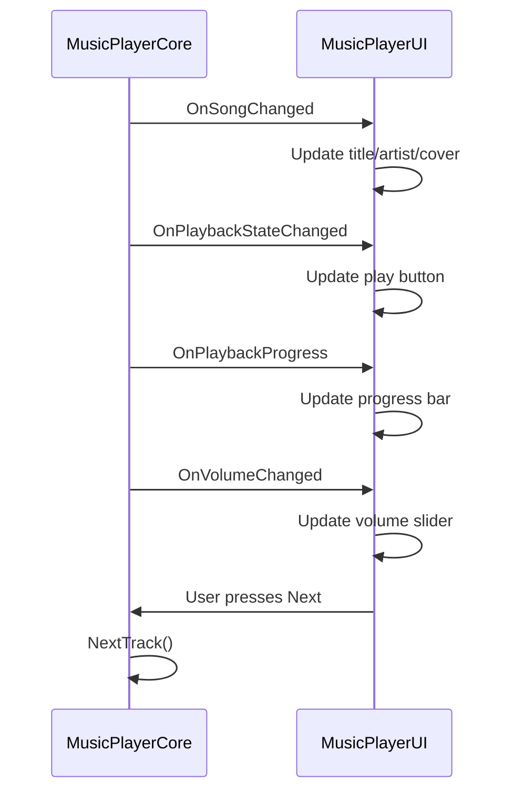

# Flows
## Core Functionality
### Playback Flow

```mermaid
graph TD
    A[Start] --> B{Play on Start?}
    B -->|Yes| C[Initialize Playlist]
    B -->|No| D[Set Stopped State]
    C --> E[Play First Song]
    E --> F{Next Track?}
    F -->|Yes| G{End of Playlist?}
    G -->|Yes| H{Loop Playlist?}
    H -->|Yes| I[Play First Song]
    H -->|No| J[Stop Playback]
    G -->|No| K[Play Next Song]
```
### Event Communication

```mermaid
sequenceDiagram
    participant MusicPlayerCore
    participant MusicPlayerUI

    MusicPlayerCore->>MusicPlayerUI: OnSongChanged
    MusicPlayerUI->>MusicPlayerUI: Update title/artist/cover

    MusicPlayerCore->>MusicPlayerUI: OnPlaybackStateChanged
    MusicPlayerUI->>MusicPlayerUI: Update play button

    MusicPlayerCore->>MusicPlayerUI: OnPlaybackProgress
    MusicPlayerUI->>MusicPlayerUI: Update progress bar

    MusicPlayerCore->>MusicPlayerUI: OnVolumeChanged
    MusicPlayerUI->>MusicPlayerUI: Update volume slider

    MusicPlayerUI->>MusicPlayerCore: User presses Next
    MusicPlayerCore->>MusicPlayerCore: NextTrack()
```

